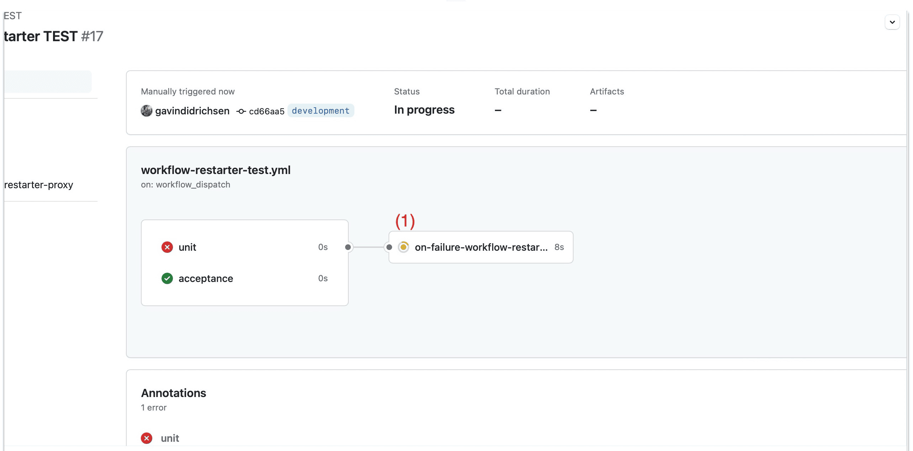
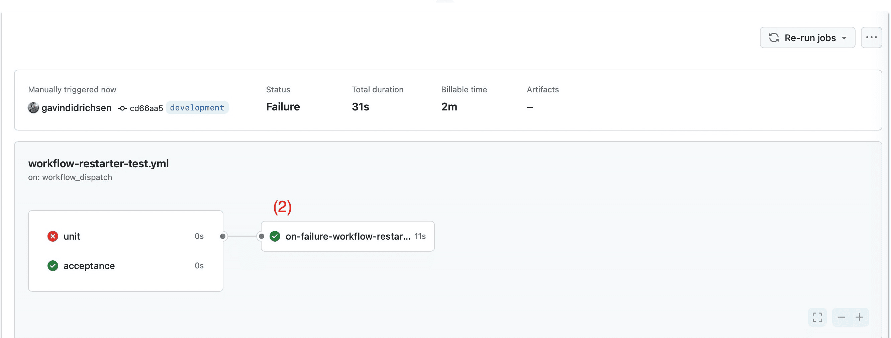
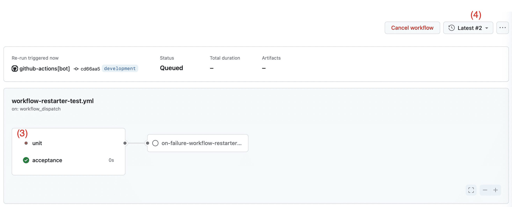

# workflow-restarter

## Description

Although GitHub provides built-in programatic mechanisms for retrying individual steps within a workflow, it doesn't provide one for retrying entire workflows.  One possible reason for this limitation may be to prevent accidental infinite retry loops around failing workflows.  Any workflow that fails, however, can be manually re-started from the failed workflow on the `Actions` tab of the repository.  For more information on restarting github worklows see [Re-running workflows and jobs](https://docs.github.com/en/actions/managing-workflow-runs/re-running-workflows-and-jobs).

Nevertheless, it is possible to programmatically restart a workflow after it fails and the section below shows how to restart a failing workflow 3 times using the `workflow-restarter` re-usable workflow.

## Usage

If setting up the the `workflow-restarter` for the first time, then make sure to initialize it first and then configure another workflow to programmatically restart on failure.

### Initialize the `Workflow Restarter`

In order to begin using the workflow-restarter, you need to first raise a PR and add the workflow restarter to your target repository.  In other words,

* Copy [workflow-restarter.yml](./workflow-restarter/workflow-restarter.yml) and [workflow-restarter-test.yml](./workflow-restarter/workflow-restarter-test.yml) to the `.github/workflows` directory of your target directory.
* Raise and merge a PR adding the above to the main branch of your repository.
* Verify that the `Workflow Restarter TEST` workflow works as expected.  See the [Appendix](#verify-workflow-restarter-with-workflow-restarter-test) for more information on what you should expect to see.

Once the above `Workflow Restarter TEST` is working then you should be able to add the workflow restarter to any of your existing github workflows.  The key is to re-use the `on-failure-workflow-restarter-proxy` located in the `Workflow Restarter TEST`.  For example, the following will trigger a restart if either the `acceptance` or the `unit` jobs preceeding it fail.  A restart of the failing jobs will be attempted 3 times at which point if the failing jobs continue to fail, then the workflow will be marked as failed.  If, however, at any point the `acceptance` and `unit` both pass fine then the restarted workflow will be marked as successful

```yaml
  on-failure-workflow-restarter-proxy:
    # (1) run this job after the "acceptance" job and...
    needs: [acceptance, unit]
    # (2) continue ONLY IF "acceptance" fails
    if: always() && needs.acceptance.result == 'failure' || needs.unit.result == 'failure'
    runs-on: ubuntu-latest
    steps:
      # (3) checkout this repository in order to "see" the following custom action
      - name: Checkout repository
        uses: actions/checkout@v4

      # (4) "use" the custom action to retrigger the failed "acceptance job" above
      - name: Trigger reusable workflow
        uses: "puppetlabs/cat-github-actions/.github/actions/workflow-restarter-proxy@main"
        env:
          SOURCE_GITHUB_TOKEN: ${{ secrets.GITHUB_TOKEN }}
        with:
          repository: ${{ github.repository }}
          run_id: ${{ github.run_id }}
```

## Appendix

### Verify `Workflow Restarter` with `Workflow Restarter TEST`

The following shows 3 `Workflow Restarter` occuring after the `Workflow Restarter TEST`, which is set to fail continuously.


Looking closer at the `Workflow Restarter TEST` reveals

* that the workflow includes 2 jobs `unit` and `acceptance`; and
* that the workflow has been re-run 3 times, e.g.,


Further, the following sequence of screenshots shows that only failed jobs are re-run.

* The `on-failure-workflow-restarter` job **(1)** is triggered by the failure of the `unit` job and **(2)** successfully calls the `workflow-restarter` workflow
* The `workflow-restarter` in turn triggers a re-run of the `unit` job **(3)** and the `Workflow Restarter TEST` shows this as an incremented attempt count at **(4)**.






